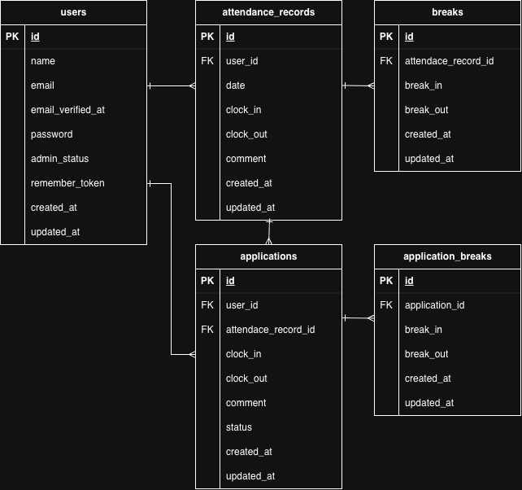

# coachtech 勤怠管理アプリ

ユーザーの出勤・退勤・休憩の打刻、勤怠確認、修正申請と、管理者による勤怠管理・修正申請の承認を行う勤怠管理アプリです。

## 主な機能

- 会員登録・ログイン・ログアウト
- メールアドレス認証
- 出勤・休憩開始・休憩終了・退勤
- 月別勤怠一覧
- 勤怠詳細表示
- 勤怠修正申請
- 修正申請一覧
- 管理者による日別勤怠管理
- 管理者によるスタッフ別勤怠管理
- 管理者による勤怠直接修正
- 管理者による修正申請承認
- 勤怠CSV出力
- 勤怠レポート
- 勤怠情報API
- Laravel SanctumによるAPI認証
- PolicyによるAPI権限制御

## 環境構築

### 1. リポジトリをクローン

~~~bash
git clone https://github.com/emi-26/attendance-app.git
cd attendance-app
~~~

### 2. Composerパッケージをインストール

~~~bash
docker run --rm \
  -u "$(id -u):$(id -g)" \
  -v "$(pwd):/var/www/html" \
  -w /var/www/html \
  -e COMPOSER_CACHE_DIR=/tmp/composer_cache \
  laravelsail/php82-composer:latest \
  composer install
~~~

### 3. .envファイルを作成

~~~bash
cp .env.example .env
~~~

`.env` の以下の項目を確認・設定します。

~~~env
DB_CONNECTION=mysql
DB_HOST=mysql
DB_PORT=3306
DB_DATABASE=laravel
DB_USERNAME=sail
DB_PASSWORD=password

MAIL_MAILER=smtp
MAIL_HOST=mailpit
MAIL_PORT=1025
~~~

### 4. Dockerコンテナを起動

~~~bash
./vendor/bin/sail up -d
~~~

### 5. アプリケーションキーを生成

~~~bash
./vendor/bin/sail artisan key:generate
~~~

### 6. マイグレーション・シーディングを実行

~~~bash
./vendor/bin/sail artisan migrate --seed
~~~

### 7. npmパッケージをインストール

~~~bash
./vendor/bin/sail npm install
~~~

### 8. Viteを起動

~~~bash
./vendor/bin/sail npm run dev
~~~

## ログイン情報

### 一般ユーザー1
- メールアドレス：user1@example.com
- パスワード：password

### 一般ユーザー2
- メールアドレス：user2@example.com
- パスワード：password

### 管理者
- メールアドレス：user3@example.com
- パスワード：password

## 使用技術

- PHP 8.2.33
- Laravel 10.50.3
- Laravel Fortify
- Laravel Sanctum
- Laravel Sail
- MySQL 8.4.11
- phpMyAdmin
- Mailpit
- Vite
- PHPUnit
- Laravel Pint

## ER図

## API

ベースURL：

~~~text
http://localhost/api/v1
~~~

勤怠情報API：

~~~text
GET    /attendance-records
GET    /attendance-records/{attendanceRecord}
POST   /attendance-records
PUT    /attendance-records/{attendanceRecord}
PATCH  /attendance-records/{attendanceRecord}
DELETE /attendance-records/{attendanceRecord}
~~~

POST・PUT・PATCH・DELETEはLaravel Sanctumによる認証が必要です。

## URL

- アプリ：http://localhost
- 一般ユーザーログイン：http://localhost/login
- 一般ユーザー会員登録：http://localhost/register
- 管理者ログイン：http://localhost/admin/login
- phpMyAdmin：http://localhost:8080
- Mailpit：http://localhost:8025
